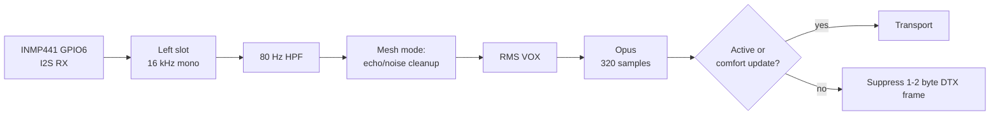

# Audio Pipeline and Voice Processing

This page describes the current audio implementation. OMI is optimized for
intelligible speech and bounded resource use, not music or stereo capture.

[TOC]

---

## 1. Audio Format

The audio component accepts one format:

| Parameter | Value |
|---|---:|
| Sample rate | 16 kHz |
| Channels | Mono |
| PCM format | Signed 16-bit |
| Frame duration | 20 ms |
| Samples per frame | 320 |
| Maximum encoded frame | 64 bytes |

The I2S bus uses 32-bit stereo slots. The microphone supplies the left input
slot; each mono playout sample is expanded and copied to both output slots.

---

## 2. Hardware I/O

### INMP441 I2S capture

The ESP32-S3 uses I2S0 in full-duplex Philips mode. It outputs 16 kHz BCLK and
WS on **GPIO4** and **GPIO5**; the INMP441 drives its data pin to **GPIO6**.
The hardware uses 32-bit stereo slots (64 BCLK per sample frame). With the
INMP441 L/R pin grounded, its 24-bit left-slot sample is sign-extended down to
the upper 16 bits for the mono Opus input.

Capture applies the enabled-by-default 80 Hz high-pass filter. In mesh mode it
also applies the current far-reference echo subtraction and noise-gain stage
before VOX and encoding. See the [wiring guide](wiring.md#i2s-digital-microphone-inmp441).

### I2S output

The ESP32-S3 is the I2S master and transmits Philips-format, 32-bit stereo at
16 kHz:

| Signal | GPIO |
|---|---:|
| BCLK | 4 |
| WS/LRCLK | 5 |
| DOUT | 7 |

There are two DMA descriptors of 320 stereo frames each. Both are preloaded
with silence before output starts. See the [audio output wiring](wiring.md#prototype-audio-output).

---

## 3. Capture and Transmit Path

The encoder runs once for every captured 20 ms frame. VOX chooses between the
captured PCM and a zero-filled PCM frame; it does not stop the encoder.

---

## 4. Opus Configuration

| Setting | Current value |
|---|---|
| Application | `OPUS_APPLICATION_VOIP` |
| Sample rate / channels | 16 kHz / mono |
| Frame size | 320 samples (20 ms) |
| Bitrate | 12,000 bit/s by default; configurable through `audio_config_t` |
| VBR | Enabled |
| In-band FEC | Enabled |
| Expected packet loss | 5% |
| Complexity | 5 |
| DTX | Enabled |
| Encoder output buffer | 64 bytes |

There is no fallback codec and no fragmentation. An encoded frame larger than
64 bytes cannot enter either the audio receive path or protocol-v2 bundle.

---

## 5. VOX and Silence

### VOX behavior

VOX computes normalized RMS over each 320-sample frame. The default behavior is:

- Activate only when RMS is strictly greater than `0.03`.
- Begin deactivation only when RMS is strictly less than `0.010`.
- Keep the middle band unchanged as hysteresis.
- Enforce 500 ms minimum active time and 500 ms hangover. Both values are
  rounded up to 20 ms frames, so the defaults are 25 frames each.
- Reset the hangover counter whenever RMS exceeds the activation threshold.

The minimum-active and hangover counters run sequentially on low-level frames,
so deactivation occurs after about 1 second of continuously sub-`0.010` input
with the default configuration. `force_tx_always` bypasses VOX for test traffic;
there is no implemented push-to-talk audio override.

### 5.1 Silence Suppression (Opus DTX)

When VOX is active, the sender marks and transmits every encoded frame. When VOX
is inactive, it encodes zero PCM with Opus DTX:

- Encoded DTX output of 1-2 bytes is suppressed before transport enqueue.
- A larger Opus comfort-noise update is transmitted with the active flag clear.
- The sender's sequence advances only for frames passed to the transport
  callback, not for suppressed DTX frames.

Presence does not depend on audio packets; mesh keepalive and status traffic has
its own cadence. See the [mesh protocol](protocol.md).

---

## 6. Protocol-v2 Bundles

The nRF52840/ESB path wraps Opus in protocol-v2 audio bundles. Each bundle has
an end-to-end 16-bit current sequence and activity bits for its frames.

The ESP32 sender currently emits:

- the current frame; and
- `previous1` only when the cached frame is active, mesh was user-enabled when
  it was cached, and it is exactly one sequence before the current frame,
  including 16-bit wraparound.

It does **not** originate `previous2`. The parser intentionally remains
compatible with bundles containing `previous2`; received predecessors are
offered oldest first (`previous2`, then `previous1`) before the current frame.
nRF relay forwarding may preserve compatible predecessor data or strip the
oldest redundancy to fit the radio budget.

This is loss redundancy, not retransmission. `previous1` can recover an isolated
loss; Opus concealment handles an unrecovered hole.

---

## 7. Receive Packet Store and Sequences

Each of the three remote-source slots owns an independent decoder, packet store,
and PCM resampler. Protocol-v2 packets are held in sequence order per source,
not global arrival order.

Exact packet-store constants are:

| Setting | Value |
|---|---:|
| Capacity | 16 packets per source |
| Startup prefill | 3 packets |
| Prefill timeout | 60 ms |
| Frame interval | 20 ms |
| Late grace | 40 ms |
| Empty-missing limit | 5 frames |

Playout starts when three packets are present or the 60 ms prefill deadline
expires. A ready expected packet can be drained immediately into the PCM ring.
If the expected packet is absent, the store waits until 40 ms after that frame's
scheduled deadline before declaring it missing. Deadlines still advance by
exactly 20 ms; the 40 ms grace is **noncumulative** and is not added to later
deadlines.

Sequence arithmetic is 16-bit wraparound-safe. Before playout, an earlier packet
may move the starting sequence backward when every queued packet still fits the
16-slot window. During playout:

- duplicate and already-delivered packets are dropped;
- packets behind the expected sequence are late and dropped;
- packets 16 or more frames ahead are outside the bounded window; the audio
  layer resets that source's store, reanchors on the new packet, and resets its
  decoder and ASRC;
- a due hole advances the expected sequence by one and requests concealment;
- after five consecutive holes with an empty store, the source enters DTX-idle
  and marks its sequence uncertain so later traffic can reanchor cleanly.

The legacy ESP-NOW transport supplies no end-to-end audio sequence. Its packets
therefore enter a per-source arrival-order FIFO: it cannot sort reordering,
identify a precise hole, or use protocol-v2 predecessor recovery. ESP-NOW also
has its own four-entry transport ring and late-drop counters; those are not the
old audio-component jitter-buffer design.

---

## 8. PLC, Concealment, and PCM ASRC

For a due sequence hole, the decoder calls `opus_decode(..., NULL, 0, ...)` and
counts a concealed-loss frame. DTX-idle also advances the Opus decoder with a
null packet, but marks the PCM inactive so it is not mixed as a talker.

Decoded PCM enters one ASRC ring per source:

| Setting | Samples | Frames / duration |
|---|---:|---:|
| Render block | 320 | 1 / 20 ms |
| Start threshold | 1,280 | 4 / 80 ms |
| Target depth | 1,280 | 4 / 80 ms |
| Ring capacity | 2,880 | 9 / 180 ms |
| Restart fade-in | 32 | 2 ms |

The PI controller adjusts linear-resampling consumption around the target:

- Normal correction is limited to **-1,000 to +1,000 ppm**.
- While compressed packets remain upstream, recovery permits positive
  correction up to **+20,000 ppm**; the negative limit remains **-1,000 ppm**.
- Positive correction consumes PCM faster. Negative correction consumes it
  slower.

On PCM underrun, output fades from the last sample to zero across one 320-sample
block, playout stops, and the decoder stream waits for another 1,280 samples.
The next successful start fades in over 32 samples. There are no hold/catch-up
frame operations or queue trimming in the current audio component.

---

## 9. Mixing and Relay Grants

The ESP32 can retain and mix up to **three remote sources**. It sums all audible
active source blocks, divides by the number mixed, and saturates to signed
16-bit. Selection is not based on loudness:

- an existing source keeps its slot;
- otherwise the first free slot is used;
- when all slots are full, a new active source may evict the source that has
  been VOX-silent longest, but only after at least **400 ms** of silence;
- inactive traffic never evicts a source;
- an empty source slot is released after 1,000 ms without an enqueue.

The mesh relay policy is a separate limit. The coordinator grants relay
bandwidth to at most **two active speakers** (`MESH_MAX_ACTIVE_SPEAKERS = 2`).
Ungranted audio remains one-hop. The three-source mixer capacity must not be read
as three relay grants.

Notification tones are mixed into the final PCM output. Bluetooth audio mixing
and ducking are not implemented in this path.

---

## 10. Latency

End-to-end mouth-to-ear latency has **not been externally measured**. The code
does not justify a `<80 ms` claim. In particular, the receive path deliberately
uses a 3-packet prefill and a 4-frame/1,280-sample ASRC start target, in addition
to capture, codec, transport, scheduling, and I2S buffering.

The reported latency fields are partial diagnostics:

- `tx_pipe_us_*` measures capture timestamp to successful nRF bridge enqueue.
- `rx_pipe_us_*` measures receive enqueue to Opus decode start; it excludes PCM
  ASRC residence and speaker output.
- `latency_ms_*` is a local capture-processing value plus a fixed DMA estimate.
  Despite its name, it is not mesh end-to-end latency.
- RTT probe data measures transport round trips, not mouth-to-ear audio latency.

Use synchronized external stimulus and output capture for a real latency result.

---

## 11. Telemetry

The audio heartbeat and `PIPE ... stage=audio` logs expose:

- complete, short, timed-out, and failed I2S microphone captures;
- encoded frames, encode errors and timing, and suppressed DTX frames;
- decoded frames, decode errors and timing, DTX PLC calls, concealed losses,
  sequence holes, sequence resets, and stale drops;
- duplicate, late, future, full-store, lock, source-rejection, and source-eviction
  drops;
- current/minimum/average/maximum aggregate packet depth;
- PCM FIFO overflow and underrun counts, current and maximum ASRC correction,
  and recovery state;
- active RX sources, complete I2S writes, incomplete I2S writes, playback loops,
  notification drops, and aggregate glitch count;
- partial TX/RX pipeline timings described above.

The protocol-v2 transport log separately reports source frames, bridge enqueue
results, bundle TX/RX/parse failures, attached predecessors, predecessor
offer/accept/reject counts, sequence gap events/frames, reordered or old current
frames, and credited recoveries. The nRF log adds relay and redundancy forwarding
or stripping counters.

Some public statistics retain legacy names for compatibility:
`grace_empty_polls`, `hold_frames`, `catchup_frames`, and `jitter_trim_frames`
remain zero. `jitter_buffer_depth` now reports aggregate packet-store depth; it
does not represent the removed audio jitter buffer.

---

## 12. Rationale (Non-Normative)

- A fixed 16 kHz mono format keeps capture, codec, transport, and playout aligned.
- Per-source ordering prevents one talker from corrupting another talker's
  sequence or decoder state.
- One predecessor gives useful isolated-loss recovery without paying for a
  second predecessor on every locally originated bundle.
- PLC avoids retransmission delay, while the ASRC absorbs producer/consumer clock
  drift without discrete hold or discard operations.
- Relay grants control radio airtime; mixer slots control local decode resources.

---

## 13. Future Work (Not Current Behavior)

- Measure mouth-to-ear latency externally and publish the test setup and result.
- Tune VOX, cleanup, Opus bitrate, packet prefill, grace, and ASRC constants from
  helmet and road-test recordings.
- Add push-to-talk only with an explicit input and tested interaction with VOX.
- Add Bluetooth mixing or ducking only after defining its clocking and priority
  behavior.
